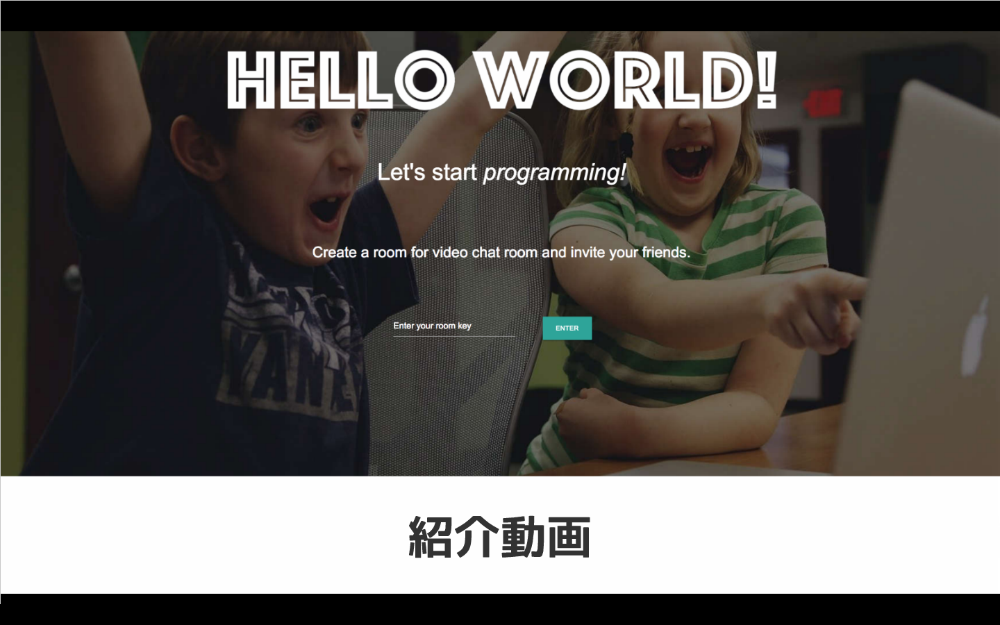

# HELLO WORLD!

## 製品概要

### 紹介動画(click to play)

### Education + Technology = Edu Tech

### 背景（製品開発のきっかけ、課題等）

近年、プログラミングに興味を持ち、学びたいと考えている人が増えています多くの人が環境構築などの学習の準備段階で躓きます。

学習のための準備が整っても、参考書には載っていない問題にぶつかる場面が多くあり、友人や先生に聞ける場が必要です。

また、プログラミングは思考の流れや考え方がその本質であるので、コミュニケーションを取りながら教え合うことが非常に効果的です。

しかし、これまでは適切なツールが無かったため、遠隔地にいる複数のユーザ間でプログラミングの協同学習を行うことは困難な問題でありました。

私たちが開発したサービス"HELLO WORLD!"によってこれらの課題を解決することができ、プログラミングを学びたい人はその本質的な技術・考え方の習得に集中することができます。

### 製品説明（具体的な製品の説明）

私たちのサービス"HELLO WORLD!"は、誰もが簡単にプログラミング学習を始められることをコンセプトにしています。

ユーザは何もインストールすることなく、すぐにプログラミングの学習をブラウザ上で始めることができます。

ユーザが書いたコードはブラウザ上でそのまま実行することができ、結果も確認できます。また、実行したコードでエラーが発生した場合、問題を解消するために参考となるウェブサイトが提案されます。

さらに、ビデオ通話をしながら同時にコードを編集することもできます。

### 特長

####1. ブラウザ上ですべてが完結

ブラウザ上で、コードの編集・実行・結果の表示が完結しているため、何もインストールすることなくプログラミングの学習が始められます。

気になったコードを手軽に実行することにも利用できます。

####2. ビデオ通話しながら共同編集

"HELLO WORLD!"は複数人でビデオ通話しながら、同じコードを編集することができます。

例えばプログラミングのオンライン授業で利用することができるでしょう。

リアルタイムのコミュニケーションにより、遠隔地にいながらも直接会って教えてもらうかのように使うことができます。

同じチャットルームにいるユーザは同じコード・結果を共有でき、同時にコードの編集ができるよう設計しています。

####3. アシスト機能

"HELLO WORLD!"はプログラムでエラーが起こった場合に、解決の助けとなるウェブサイトを提案してくれます。

プログラミング初心者に対してはエラーが理解できず苦しむということを減らし、上級者に対してはエラー対処の効率化を図ることができます。

また、autocomplete機能により円滑なコーディングをサポートします。

### 解決出来ること

"HELLO WORLD!"はプログラミングの学習を始める上で必要であった、環境構築のハードルを取り払います。

ウェブブラウザのみでプログラミングを始められ、より多くの人がプログラミングの本質的な学習に時間を費やすことができます。

また、これまで困難であった遠隔でのプログラミングの協同学習を、ビデオ通話とコードの共有・同時編集機能によって可能としました。

### 今後の展望

- エディタとしての機能の拡充
- より円滑なコミュニケーションができる機能を提供
- アシスト機能のインテリジェント化
- 多人数の同時接続に耐え得る、スケーラビリティの高いシステム設計

これらを行い、学校などの教育現場や社内での研修、友人同士などで利用して頂き、プログラミングを始めたい・本格的に学びたい人々の成長をサポートしたいと考えています。

### 注力したこと（こだわり等）

- メイン画面では、コーディング画面に移るためのフォームが目立つようにしておき、入力を促すように配慮しています。
- 複数のユーザがリアルタイムで同じコードを見ながら、編集・実行することができるようにし、円滑なコミュニケーションを可能にしました。
- セキュリティに配慮し、Dockerコンテナ内でユーザのコードを安全に実行する仕組みを構築しました。

## 開発技術

### 活用した外部技術

#### API・データ

* [SkyWay ― WebRTCを簡単＆柔軟に使えるプラットフォーム](https://nttcom.github.io/skyway/)

#### フレームワーク・ライブラリ・モジュール

* バックエンド
  * [gin-gonic/gin](https://github.com/gin-gonic/gin)
  * [Beautiful Soup: We called him Tortoise because he taught us.](https://www.crummy.com/software/BeautifulSoup/)

* フロントエンド
  * [Dogfalo/materialize](https://github.com/Dogfalo/materialize)
  * [AngularJS — Superheroic JavaScript MVW Framework](https://angularjs.org/)
  * [jQuery](https://jquery.com/)
  * [ace](https://ace.c9.io/)

#### その他

* [Docker - Build, Ship, and Run Any App, Anywhere](https://www.docker.com/)
* [Google Compute Engine(Google Cloud Platform)](https://cloud.google.com/)

### 独自技術

#### 期間中に開発した独自機能・技術

* 複数のユーザが同じコードを編集する際に、各ユーザのカーソルの位置を推定するアルゴリズムを開発しました。各ユーザのカーソルの位置を共有し、編集が行われた前後の文字列とカーソルの位置関係を比較することで各ユーザのカーソルの位置がどこにあるのかを計算します。
