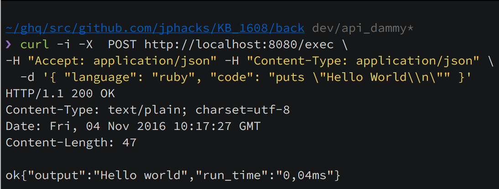
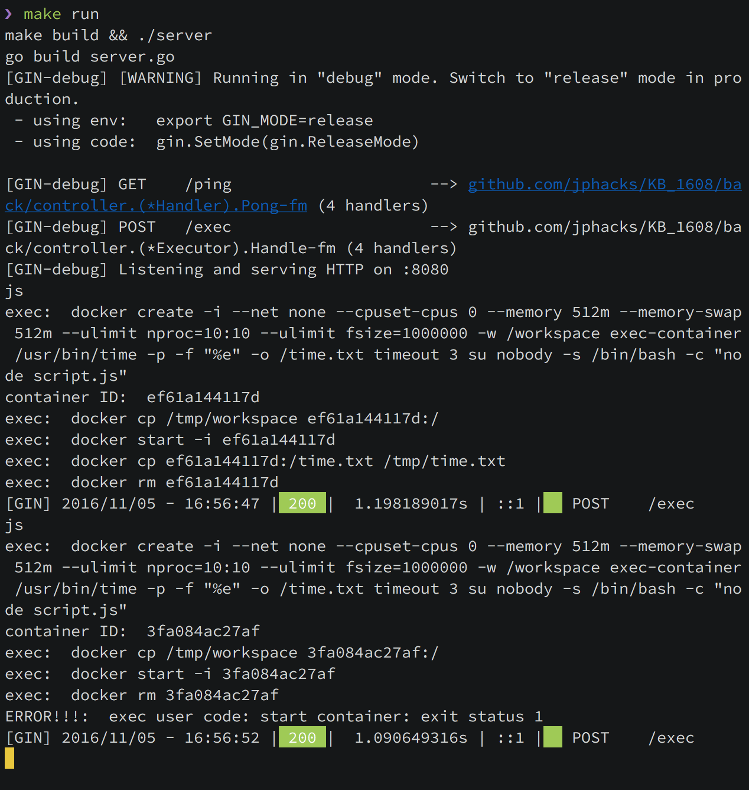

# Backend Application

## Installation

```sh
$ make setup # Install go and some tools
```

## Build and run server

This application host `./public` directory on server root.

```sh
$ make migrate # Copy files of `public/` in `front/public/` to `backend/public`
$ make run # Run server on http://localhost:8080/
```

### example

- Request

```
[POST] /exec
```

```json
{
    "language": "ruby",
    "code": "puts \"Hello World\\n\""
}
```

- Response

status: 200(OK)

```json
{
    "output": "Hello world",
    "run_time": "0,04ms"
}
```

#### In curl case

- curl

```sh
$ curl -i -X  POST http://localhost:8080/exec \
    -H "Accept: application/json" -H "Content-Type: application/json" \
    -d '{ "language": "ruby", "code": "puts \"Hello World\\n\"" }'
```



- Server


